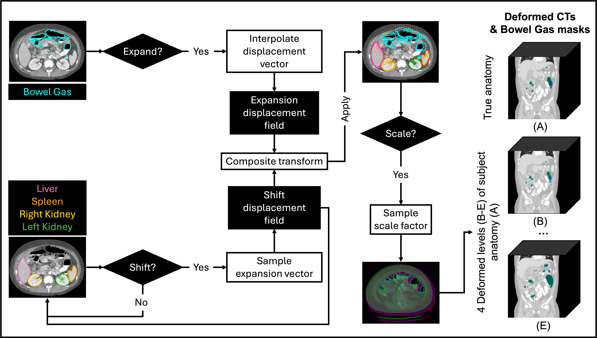

# abdo-deform
## Description

**abdo-deform** is a [PlatiPy](https://github.com/pyplati/platipy?tab=readme-ov-file)-based, paediatric population-informed synthetic deformation framework designed to generate anatomically realistic abdominal variations in CT images. It models intra-subject variability using three organ-specific non-linear transformations:
- Isotropic shrinkage/ expansion of the bowel gas.
- Shifting of the liver, spleen, and kidneys.
- Uniform scaling of the CT image.



## Getting started
Begin by creating and activating a virtual environment, then install the required dependencies:
```bash
# Set up the virtual environment (tested with Python 3.9.5)
python -m venv deform_venv
source deform_venv/bin/activate

# Install required packages
pip install -r requirements.txt
```
## Run deformation pipeline

The deformation pipeline consists of **three steps**, located in the `deformation_pipeline` folder.
```
├── abdo-deform
│   ├── deformation_pipeline
│   │   ├── deformation_utils.py
│   │   ├── step1_calibration.py
│   │   ├── step2_deformation.py
│   │   ├── step3_scaling.py
│   ├── data
│       ├── input_CT
│       ├── input_SEG
```

You may place any required input CT images and corresponding organ segmentations inside a `data` folder, as the code is structured to load files from there.


### Step 1: Bowel Gas Calibration
PlatiPy applies anatomical constraints that limit how much the bowel gas can be expanded or shrunk in a given subject. To determine the full feasible gas expansion range for each subject CT, percentage changes in bowel gas volume must first be calibrated against known expansion vectors.

From the root directory (`abdo-deform`), run:

```bash
python deformation_pipeline/step1_calibration.py
```

### Step 2: Apply Deformation

In this step, the pipeline generates:
- **Four deterministic isotropic bowel gas expansion states**. These correspond to the subject-specific maximum shrinkage, maximum expansion, and two intermediate levels evenly spaced between them. (The four states are fixed in number, but their magnitudes vary per subject based on the calibration obtained in Step 1.)
- **Shifts of the liver, spleen, left and right kidneys**. Random displacement vectors are independently sampled in x, y, and z directions from uniform distributions bounded by inter-fractional motion ranges reported by [Guerreiro et al. (2018)](https://pubmed.ncbi.nlm.nih.gov/29457751/).

The script generates four deformed versions for one subject CT.

```bash
python deformation_pipeline/step2_deformation.py
```

### Step 3: Apply Scaling

The final step of the pipeline simulates ± 1 year of **anatomical growth** by uniformly scaling the CT image and its associated structures. A random scaling factor is sampled from a uniform distribution ranging ± 4.5%, an average growth factor derived from standardised paediatric growth charts published by the United States National Centre for Health Statistics, [Kuczmarski et al. (2000)](https://pubmed.ncbi.nlm.nih.gov/11183293/).

The scripts scales the four deformed CT versions generated at Step 2, and saves each as a separate file.

```bash
python deformation_pipeline/step3_scaling.py
```

## Publication
When referencing, please include a bibliographical reference to the paper below:

A-C Ghica, M Simard, Mikaël; S Yu, A Nisbet,J Gains, Y Zhang, P Lim, and C Veiga. "A novel deep-learning approach for monitoring gastrointestinal air variation during radiotherapy in young patients using radiographs". [Physics in Medicine & Biology 71 (2026) 095025](https://doi.org/10.1088/1361-6560/ae6222).

## License
abdo-deform is © 2025, Cristina Ghica. 

abdo-deform is published and distributed under the Academic Software License v1.0 (ASL). abdo-deform is distributed in the hope that it will be useful for non-commercial academic research, but WITHOUT ANY WARRANTY; without even the implied warranty of MERCHANTABILITY or FITNESS FOR A PARTICULAR PURPOSE. See the ASL for more details.
